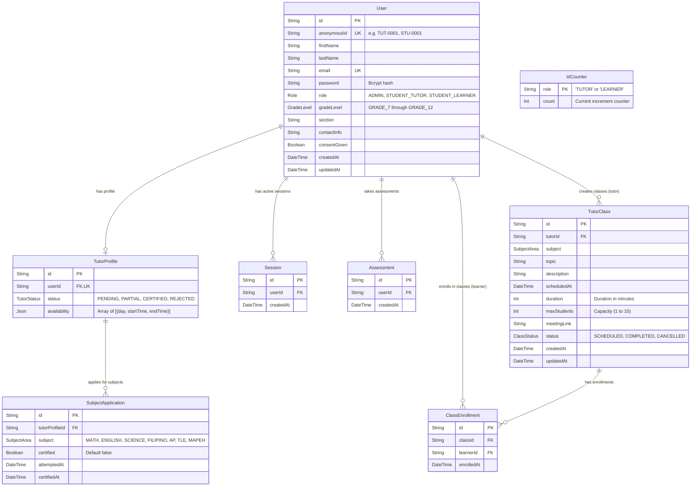

# 📚 Katuwang — Comprehensive Project Implementation & Progress Report

> **Project Name:** Katuwang (Peer Tutoring Web Application for High School Students)  
> **Repository:** `Adb-Polar/katuwang`  
> **Status:** Active Development (Phase 1 & Core Scheduling Implemented)  
> **Current Version:** `v0.1.0`  
> **Tech Stack:** Next.js 16 (App Router) · React 19 · TypeScript 5 · Tailwind CSS 4 · DaisyUI 5 · NextAuth.js 4 · Prisma ORM 7 · MariaDB/MySQL · Zod · Bcryptjs  
> **Date of Report:** August 2026  

---

## 📑 Table of Contents

1. [Executive Summary](#1-executive-summary)
2. [Architecture & Technology Stack](#2-architecture--technology-stack)
3. [Implemented Modules & Features](#3-implemented-modules--features)
   - [3.1 Identity, Authentication & Security Layer](#31-identity-authentication--security-layer)
   - [3.2 User Registration & Onboarding Flow](#32-user-registration--onboarding-flow)
   - [3.3 Concurrency-Safe Anonymous ID Engine](#33-concurrency-safe-anonymous-id-engine)
   - [3.4 Tutor Class Scheduling & Management Engine](#34-tutor-class-scheduling--management-engine)
   - [3.5 Role-Based Dashboards & Portals](#35-role-based-dashboards--portals)
   - [3.6 Design System & UI/UX Styling](#36-design-system--uiux-styling)
4. [Database Schema & Data Models](#4-database-schema--data-models)
5. [API Routes & Endpoints Reference](#5-api-routes--endpoints-reference)
6. [Implementation Status Matrix](#6-implementation-status-matrix)
7. [Directory Structure & File Inventory](#7-directory-structure--file-inventory)
8. [Setup, Verification & Testing Guide](#8-setup-verification--testing-guide)
9. [Future Roadmap & Next Sprints](#9-future-roadmap--next-sprints)

---

## 1. Executive Summary

**Katuwang** (Tagalog for *"helper"* or *"partner"*) is a specialized web-based peer tutoring and academic mentoring platform engineered specifically for Junior and Senior High School students (Grades 7–12) within the Philippine K-12 educational framework.

### Core Objectives
1. **Student Privacy by Design:** Implements double-blind sequential anonymous identities (`STU-XXXX` for learners and `TUT-XXXX` for tutors) to safeguard student personal information in compliance with the **Philippine Data Privacy Act of 2012 (RA 10173)**.
2. **Competency-Based Quality Assurance:** Ensures tutors can only host classes in subjects where they have achieved certified qualification status.
3. **Structured Peer Tutoring:** Facilitates 1-on-1 and small-group tutoring sessions with automated scheduling conflict detection, enrollment tracking, and capacity management.
4. **Multi-Tiered Role Governance:** Provides tailored portals and access control for three distinct stakeholder roles: Student Learners, Student Tutors, and Administrators.

---

## 2. Architecture & Technology Stack

The platform follows a modern full-stack monolithic architecture using the **Next.js App Router**, leveraging React Server Components (RSC) for optimized data fetching and client-side interactivity for real-time forms and management modals.

```
┌─────────────────────────────────────────────────────────────────────────┐
│                           Client / Browser                              │
│  - React 19 UI Components (Forms, Class Management Modals, Dashboards)  │
│  - Tailwind CSS 4 + DaisyUI 5 Theme (OKLCH Color Spaces)                │
└────────────────────────────────────┬────────────────────────────────────┘
                                     │ HTTPS Requests / NextAuth Sessions
┌────────────────────────────────────▼────────────────────────────────────┐
│                    Next.js Application Layer (Node.js)                  │
│                                                                         │
│  ┌──────────────────────┐  ┌─────────────────────┐  ┌────────────────┐  │
│  │ Route Guards / Proxy │  │ Server Route Handlers│  │ NextAuth Auth │  │
│  │ (Role-based RBAC)    │  │ (REST Endpoints)    │  │ (JWT Provider) │  │
│  └──────────────────────┘  └──────────┬──────────┘  └────────────────┘  │
│                                       │                                 │
│  ┌────────────────────────────────────▼──────────────────────────────┐  │
│  │ Input Validation & Integrity (Zod Schemas)                        │  │
│  └────────────────────────────────────┬──────────────────────────────┘  │
│                                       │                                 │
│  ┌────────────────────────────────────▼──────────────────────────────┐  │
│  │ Prisma ORM Client (@prisma/adapter-mariadb / MySQL Engine)        │  │
│  └────────────────────────────────────┬──────────────────────────────┘  │
└───────────────────────────────────────┼─────────────────────────────────┘
                                        │
┌───────────────────────────────────────▼─────────────────────────────────┐
│                      Database Layer (MariaDB / MySQL)                   │
│  - Users, Tutor Profiles, Subject Applications, ID Counters             │
│  - Tutor Classes, Class Enrollments, Assessments, Sessions              │
└─────────────────────────────────────────────────────────────────────────┘
```

### Detailed Stack Specifications

| Layer | Technology | Details / Purpose |
|---|---|---|
| **Framework** | Next.js `16.2.9` | App Router architecture, Server Actions, Route Handlers, Turbopack support |
| **UI Library** | React `19.2.4` | Component-driven frontend with Server and Client Components (`"use client"`) |
| **Language** | TypeScript `5.x` | Strict type safety across database models, validation schemas, and API responses |
| **Styling & Theme** | Tailwind CSS `4.x` + DaisyUI `5.6.13` | Modern design system utilizing OKLCH color values, customizable theme tokens |
| **Authentication** | NextAuth.js `4.24.14` | Credentials provider, JWT session strategy, custom token claims |
| **ORM** | Prisma ORM `7.8.0` | Schema migrations, type-safe queries, transaction support |
| **Database** | MariaDB / MySQL | Relational data persistence with foreign keys and cascade rules |
| **Validation** | Zod `4.4.3` | Strict runtime request body validation and discriminated union parsing |
| **Password Security**| `bcryptjs` / `bcrypt` | 12-round salted password hashing |
| **Icons** | Lucide React `1.23.0` | Vector icon pack for UI controls and navigation |

---

## 3. Implemented Modules & Features

### 3.1 Identity, Authentication & Security Layer
- **Credentials Authentication Provider:** Implemented in `src/lib/auth.ts` using NextAuth. Validates email and bcrypt password hashes against the MariaDB database.
- **Enriched JWT Token Payload:** Extends default session with `id`, `anonymousId`, `role`, and `fullName`.
- **Session Duration:** Configured with an 8-hour max age (`8 * 60 * 60` seconds) to match standard school-day usage without requiring repetitive logins.
- **Centralized Dashboard Dispatcher (`src/app/dashboard/page.tsx`):** Acts as a smart router that evaluates the authenticated user's role and instantly routes them to their dedicated portal:
  - `STUDENT_LEARNER` ➔ `/learner`
  - `STUDENT_TUTOR` ➔ `/tutor`
  - `ADMIN` ➔ `/admin`
- **Route Guard Middleware / Proxy (`src/proxy.ts`):** Protects routes matching `/dashboard/*`, `/tutor/*`, `/learner/*`, and `/admin/*`. Redirects unauthorized users directly to `/unauthorized`.
- **Access Denied Screen (`src/app/unauthorized/page.tsx`):** Styled fallback view with helpful navigation to guide students back to their permitted dashboards.

---

### 3.2 User Registration & Onboarding Flow
- **Role Selection Portal (`src/app/register/page.tsx`):** Visual landing page allowing applicants to choose between registering as a **Student Learner** or applying as a **Student Tutor**.
- **Learner Registration Form (`src/components/auth/LearnerRegisterForm.tsx`):**
  - Collects First Name, Last Name, Email, Password, Grade Level (Grade 7 to 12), Section, and Contact Info.
- **Tutor Application Form (`src/components/auth/TutorRegisterForm.tsx`):**
  - Ingests tutor applicant profile, academic level, and schedules.
  - Automatically initializes a linked `TutorProfile` with `PENDING` status.
- **Unified Registration API (`src/app/api/register/route.ts`):**
  - Validates payload with Zod discriminated union (`learnerRegisterSchema` vs. `tutorRegisterSchema`).
  - Checks for duplicate email collisions.
  - Hashes passwords using `bcrypt.hash(password, 12)`.
  - Atomically allocates the next sequential anonymous ID.
  - Executes multi-model creations within a database transaction (`prisma.$transaction`).

---

### 3.3 Concurrency-Safe Anonymous ID Engine
- **Implementation (`src/lib/idGenerator.ts`):**
  - Generates sequential IDs: `STU-0001`, `STU-0002`... for learners and `TUT-0001`, `TUT-0002`... for tutors.
  - Operates on the dedicated `IdCounter` table using Prisma's atomic `increment: 1` update to eliminate race conditions under concurrent registration requests.
  - Formats numbers with zero-padded 4-digit indexes (`String(count).padStart(4, "0")`).

---

### 3.4 Role-Based Dashboards & Portals

| Portal Route | Target Role | Key Features Implemented |
|---|---|---|
| `/tutor` | `STUDENT_TUTOR` | Anonymous ID badge, Tutor Certification Status badge (`PENDING`, `PARTIAL`, `CERTIFIED`), list of applied subjects with exam statuses, integrated Class Scheduling & Management component, Account metadata card. |
| `/learner` | `STUDENT_LEARNER` | Anonymous ID badge, Request Session call-to-action, Upcoming Tutoring Sessions card, Account metadata card. |
| `/admin` | `ADMIN` | System administrator dashboard, user management interface stubs, platform-wide matching telemetry. |

---

### 3. Design System & UI/UX Styling
- **Color Palette & Theme Tokens (`src/app/globals.css`, `docs/style theme.md`):** Configured with custom DaisyUI theme tokens using OKLCH color space for accessibility and crisp contrast.
- **Custom Brand Mark (`src/components/symbols/icon.tsx`):** Custom SVG icon representing the Katuwang emblem.
- **Responsive Layouts (`src/components/auth/AuthLayout.tsx`):** Standardized, centered authentication and registration layout containers with clean borders and subtle shadows.

---

## 4. Database Schema & Data Models

The MariaDB database schema is managed via Prisma (`prisma/schema.prisma`).



### Enumeration Definitions

- **`Role`:** `ADMIN`, `STUDENT_TUTOR`, `STUDENT_LEARNER`
- **`GradeLevel`:** `GRADE_7`, `GRADE_8`, `GRADE_9`, `GRADE_10`, `GRADE_11`, `GRADE_12`
- **`SubjectArea`:** `MATH`, `ENGLISH`, `SCIENCE`, `FILIPINO`, `ARALING_PANLIPUNAN`, `TLE`, `MAPEH`
- **`TutorStatus`:** `PENDING`, `PARTIAL`, `CERTIFIED`, `REJECTED`
- **`ClassStatus`:** `SCHEDULED`, `COMPLETED`, `CANCELLED`

---

## 5. API Routes & Endpoints Reference

| Method | Endpoint | Access Level | Description |
|---|---|---|---|
| `POST` | `/api/register` | Public | Registers a new Learner or Tutor, generating an anonymous ID and password hash. |
| `POST` | `/api/auth/[...nextauth]` | Public | Handles login credentials authentication and NextAuth session lifecycle. |
| `GET` | `/api/tutor/classes` | `STUDENT_TUTOR` | Fetches all classes created by the authenticated tutor, with optional `?status=` query filter and enrolled learners. |
| `POST` | `/api/tutor/classes` | `STUDENT_TUTOR` | Creates a new tutoring class with subject certification check and time-overlap collision validation. |
| `PATCH`| `/api/tutor/classes/[classId]` | `STUDENT_TUTOR` (Owner) | Updates class metadata, schedule, capacity, or transitions status (`COMPLETED`/`CANCELLED`). |
| `DELETE`| `/api/tutor/classes/[classId]` | `STUDENT_TUTOR` (Owner) | Deletes a scheduled class (restricted if learners have already enrolled). |

---

## 6. Implementation Status Matrix

| Module / Feature | Status | Implementation Details |
|---|:---:|---|
| **Database Schema & Migrations** | 🟢 Completed | Full MariaDB schema with Prisma ORM, relations, and unique constraints. |
| **Database Seeding (`seed.ts`)** | 🟢 Completed | Initial baseline seed for `IdCounter` table (`TUTOR` & `LEARNER`). |
| **Bcrypt Authentication & NextAuth** | 🟢 Completed | NextAuth credentials provider, password hashing, JWT sessions. |
| **Atomic Anonymous ID Generation** | 🟢 Completed | Transactional atomic counters producing `STU-0001` & `TUT-0001`. |
| **Learner Registration & Validation**| 🟢 Completed | Full Zod schema validation, data privacy consent, form UI. |
| **Tutor Registration & Validation** | 🟢 Completed | Profile initialization, subject application records, form UI. |
| **Route Protection & RBAC Proxy** | 🟢 Completed | Server-side role validation on all portals and API routes. |
| **Tutor Class Management UI** | Pending | Tabbed interface, scheduling modal, inspector modal, delete/complete actions. |
| **Tutor Class Creation API** | Pending | Zod validation, certification enforcement, past date & overlap protection. |
| **Tutor Class Update & Delete API** | Pending | Partial updates, enrollment-based capacity restrictions, safe delete checks. |
| **Learner Portal UI Baseline** | Pending | Dashboard layout with anonymous ID badge and quick links. |
| **Admin Portal Baseline** | Pending | Secured role-based views with user greetings and signout. |
| **Diagnostic Assessment Engine** | Sprint 2 | Stub models created (`Assessment`); interactive quiz UI pending. |
| **Learner Class Browsing & Enrollment**| Sprint 3 | Enrollment model ready; learner discovery and booking UI pending. |

---

## 7. Directory Structure & File Inventory

```
katuwang/
├── docs/
│   ├── database_schema.md           # Database architecture and model specifications
│   ├── Register & Login.md          # Implementation guide for authentication
│   ├── Register & Login Plus.md     # Detailed architecture tutorial & reference
│   └── style theme.md               # DaisyUI & CSS design system token definitions
├── prisma/
│   ├── migrations/                  # SQL migration history files
│   ├── schema.prisma                # Core Prisma database schema
│   └── seed.ts                      # Seeder script for initial IdCounter records
├── src/
│   ├── app/
│   │   ├── admin/page.tsx           # Administrator dashboard portal
│   │   ├── api/
│   │   │   ├── auth/[...nextauth]/  # NextAuth authentication route handler
│   │   │   ├── register/route.ts    # User registration endpoint
│   │   │   └── tutor/classes/       # Tutor class CRUD API endpoints
│   │   ├── dashboard/page.tsx       # Smart role-based dashboard router
│   │   ├── learner/page.tsx         # Student Learner dashboard portal
│   │   ├── login/page.tsx           # User login page
│   │   ├── page.tsx                 # Root landing navigation
│   │   ├── register/                # Registration portal (Learner, Tutor, Hub)
│   │   ├── tutor/page.tsx           # Student Tutor dashboard portal
│   │   ├── unauthorized/page.tsx    # Access denied fallback page
│   │   ├── globals.css              # Global styles, Tailwind & DaisyUI theme
│   │   └── layout.tsx               # Root application layout
│   ├── components/
│   │   ├── auth/                    # Auth layout, Login, and Registration forms
│   │   ├── providers/               # NextAuth SessionProvider wrapper
│   │   ├── symbols/                 # Brand logo and custom SVG icons
│   │   └── tutor/                   # ClassManagement and tutor UI components
│   ├── lib/
│   │   ├── auth.ts                  # NextAuth options and credentials configuration
│   │   ├── idGenerator.ts           # Concurrency-safe anonymous ID generator
│   │   ├── prisma.ts                # Singleton Prisma client instance
│   │   └── validations/             # Zod schemas (auth.ts, class.ts)
│   ├── proxy.ts                     # NextAuth middleware route guards (RBAC)
│   └── types/
│       └── next-auth.d.ts           # Custom TypeScript declarations for NextAuth
├── package.json                     # Project manifest and scripts
├── prisma.config.ts                 # Prisma CLI configuration
└── tsconfig.json                    # TypeScript compiler options
```
