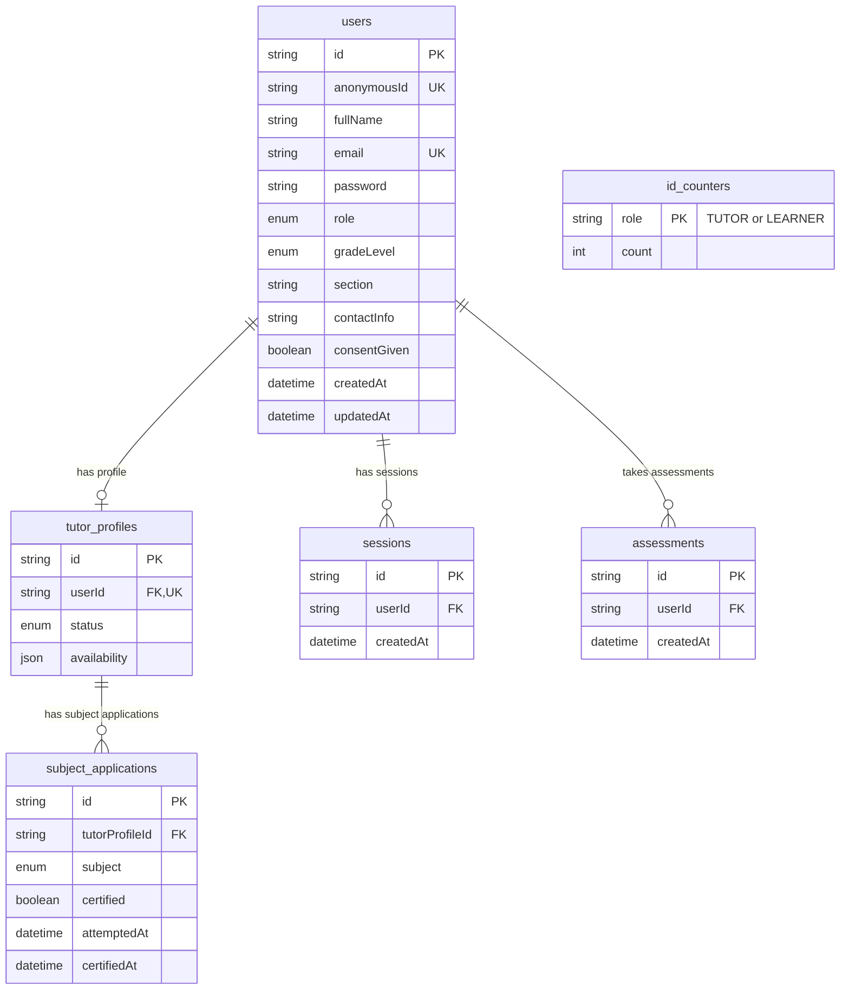

# Katuwang Database Schema Documentation

This document provides a comprehensive overview of the database schema for the **Katuwang** peer tutoring platform. The database uses **MariaDB/MySQL** as the storage engine and **Prisma ORM** as the database client.

The schema is defined in [schema.prisma](file:///home/hikaru/Capstone/katuwang/prisma/schema.prisma).

---

## Database Configuration

- **ORM**: Prisma Client (`prisma-client-js`)
- **Database Engine**: MariaDB / MySQL
- **Connection URL Variable**: `DATABASE_URL` (configured in `.env`)

---

## Entity-Relationship Diagram (ERD)

Below is the conceptual and structural ERD of the Katuwang database.



---

## Enums

The schema defines several custom enumerations to enforce role-based access control, academic levels, subject certifications, and tutor status tracking.

### `Role`
Defines the permissions and roles of users on the platform.
| Value | Description |
| :--- | :--- |
| `ADMIN` | Platform administrators with full system access. |
| `STUDENT_TUTOR` | Qualified students certified to tutor in one or more subjects. |
| `STUDENT_LEARNER` | Students registered to receive tutoring support. |

### `GradeLevel`
Represents the target academic levels (Junior & Senior High School) in the Philippine K-12 educational framework.
* `GRADE_7`
* `GRADE_8`
* `GRADE_9`
* `GRADE_10`
* `GRADE_11`
* `GRADE_12`

### `TutorStatus`
Represents the qualification and certification lifecycle of a tutor candidate.
| Value | Description |
| :--- | :--- |
| `PENDING` | Registered tutor; no assessments have been attempted or completed yet. |
| `PARTIAL` | Certified in some applied subjects, while others are still pending or failed. |
| `CERTIFIED` | Successfully certified and passed assessments for all applied subjects. |
| `REJECTED` | Did not pass any assessments for applied subjects. |

### `SubjectArea`
Academic areas offered for peer tutoring.
* `MATH`
* `ENGLISH`
* `SCIENCE`
* `FILIPINO`
* `ARALING_PANLIPUNAN` (Social Studies)
* `TLE` (Technology and Livelihood Education)
* `MAPEH` (Music, Arts, Physical Education, and Health)

---

## Models Reference

### 1. `User` (`users` table)
Stores the master credentials, contact details, role-based metadata, and student demographic details.

| Field Name | Type | Constraints / Attributes | Description |
| :--- | :--- | :--- | :--- |
| `id` | `String` | `@id`, `@default(cuid())` | Unique system identifier. |
| `anonymousId` | `String` | `@unique` | Sequential anonymous ID (e.g., `TUT-0001` or `STU-0001`) to protect student privacy. |
| `fullName` | `String` | | Full name of the user. |
| `email` | `String` | `@unique` | User login email. |
| `password` | `String` | | Bcrypt password hash. |
| `role` | `Role` | | Access level of the user. |
| `gradeLevel` | `GradeLevel`| | Current school grade level. |
| `section` | `String` | | Classroom section identifier. |
| `contactInfo` | `String?` | `Nullable` | Contact phone number or secondary info. |
| `consentGiven`| `Boolean` | `@default(false)` | Consent checkbox for terms of service / data privacy. |
| `createdAt` | `DateTime` | `@default(now())` | Creation timestamp. |
| `updatedAt` | `DateTime` | `@updatedAt` | Timestamp of the last update. |

#### Relations
- **`tutorProfile`**: A one-to-one relationship to `TutorProfile?`.
- **`sessions`**: A one-to-many relationship to `Session[]`.
- **`assessments`**: A one-to-many relationship to `Assessment[]`.

---

### 2. `TutorProfile` (`tutor_profiles` table)
Holds tutor-specific data such as availability schedules and validation statuses. Created only for users acting as `STUDENT_TUTOR`.

| Field Name | Type | Constraints / Attributes | Description |
| :--- | :--- | :--- | :--- |
| `id` | `String` | `@id`, `@default(cuid())` | Unique identifier for the profile. |
| `userId` | `String` | `@unique` | Foreign key referencing `User.id`. |
| `status` | `TutorStatus`| `@default(PENDING)` | Current registration/certification status. |
| `availability` | `Json` | | Weekly availability hours. Saved as JSON format (e.g., `[{ "day": "Monday", "startTime": "13:00", "endTime": "15:00" }]`). |

#### Relations
- **`user`**: Links back to the parent `User` record.
- **`appliedSubjects`**: A one-to-many relationship to `SubjectApplication[]` tracks subjects the tutor applied to teach.

---

### 3. `SubjectApplication` (`subject_applications` table)
Tracks which subject areas a tutor has applied to teach and their certification status for each individual subject.

| Field Name | Type | Constraints / Attributes | Description |
| :--- | :--- | :--- | :--- |
| `id` | `String` | `@id`, `@default(cuid())` | Unique identifier. |
| `tutorProfileId`| `String` | | Foreign key referencing `TutorProfile.id`. |
| `subject` | `SubjectArea`| | Subject area being applied for. |
| `certified` | `Boolean` | `@default(false)` | Indicates if the tutor is approved to teach this subject. |
| `attemptedAt` | `DateTime?`| `Nullable` | Timestamp when the user took the diagnostic/certification test. |
| `certifiedAt` | `DateTime?`| `Nullable` | Timestamp when user was officially certified for this subject. |

#### Constraints
- **Unique Compound Key**: `@@unique([tutorProfileId, subject])` enforces that a tutor profile can only have one application record per subject.

---

### 4. `IdCounter` (`id_counters` table)
Stores role-based sequential count tracking. Used to programmatically generate unique anonymous IDs (e.g. `TUT-0001` or `STU-0001`) during registration.

| Field Name | Type | Constraints / Attributes | Description |
| :--- | :--- | :--- | :--- |
| `role` | `String` | `@id` | Key specifying the role, either `"TUTOR"` or `"LEARNER"`. |
| `count` | `Int` | `@default(0)` | Current sequential index count. |

---

### 5. `Session` (`sessions` table)
Fallback stub for NextAuth or generic JWT-based session tracking.

| Field Name | Type | Constraints / Attributes | Description |
| :--- | :--- | :--- | :--- |
| `id` | `String` | `@id`, `@default(cuid())` | Unique session ID. |
| `userId` | `String` | | Foreign key referencing `User.id`. |
| `createdAt` | `DateTime` | `@default(now())` | Timestamp of session creation. |

#### Foreign Key Cascade
- Cascades deletion of the session if the corresponding `User` is deleted (`onDelete: Cascade`).

---

### 6. `Assessment` (`assessments` table)
Stub model for future enhancement (Sprint 2) to store evaluation attempts and score records of users.

| Field Name | Type | Constraints / Attributes | Description |
| :--- | :--- | :--- | :--- |
| `id` | `String` | `@id`, `@default(cuid())` | Unique assessment tracking identifier. |
| `userId` | `String` | | Foreign key referencing `User.id`. |
| `createdAt` | `DateTime` | `@default(now())` | Creation timestamp. |

---

## Architectural Patterns & Design Decisions

1. **Anonymous Identity Protection (`anonymousId`)**:
   To ensure privacy and data security for student users, public interactions display an anonymous key (e.g. `TUT-0001` for tutors or `STU-0001` for learners) rather than full names. The `IdCounter` table acts as a atomic counter mechanism to safely increment and generate these sequential IDs concurrently.
2. **Subject-Specific Certification (`SubjectApplication`)**:
   Instead of a monolithic certification status, tutors can apply for and be certified in multiple subjects independently. A tutor's global status (`TutorStatus`) is derived dynamically from these sub-applications.
3. **Availability Schedule Storage (`availability: Json`)**:
   To avoid complex table joins and schema updates for schedule variations, tutor availability is stored as a flexible structured JSON block representing days and hours of operation.

---

## Getting Started

### 1. Database Seeding
To initialize the `id_counters` table with baseline rows for tutors and learners, run the database seed command:

```bash
npx prisma db seed
```

This invokes the seed script defined in [seed.ts](file:///home/hikaru/Capstone/katuwang/prisma/seed.ts) to populate `IdCounter` records.

### 2. Generating the Prisma Client
If you update the schema, regenerate the Prisma Client using:

```bash
npx prisma generate
```

### 3. Applying Migrations
Apply schema changes to your database engine:

```bash
npx prisma migrate dev --name <migration_name>
```
