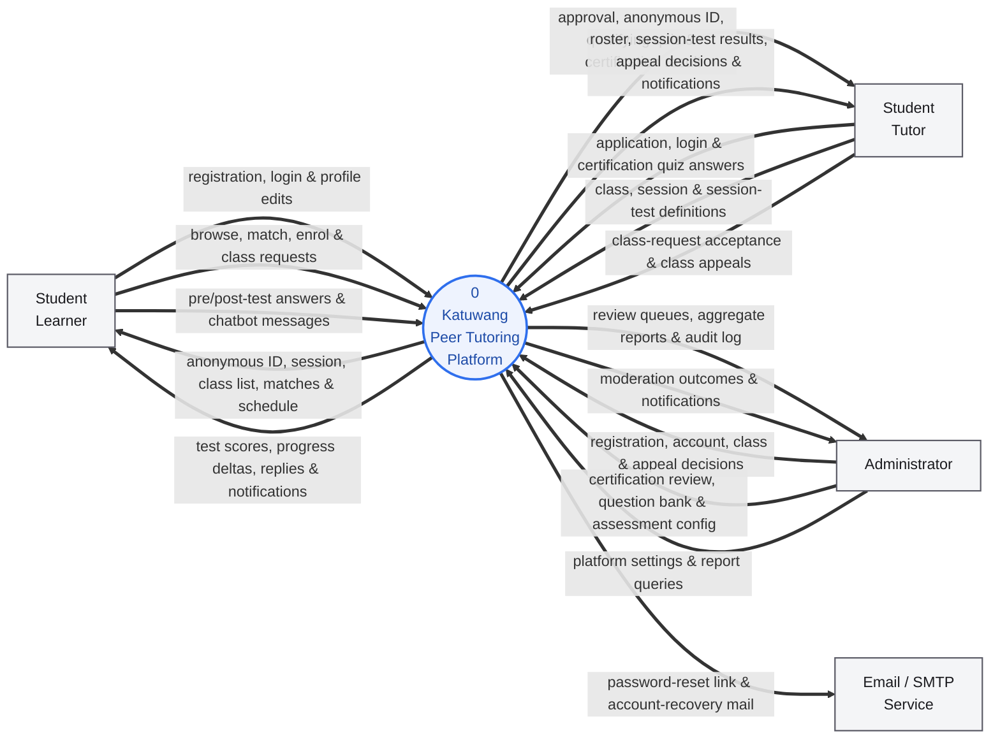
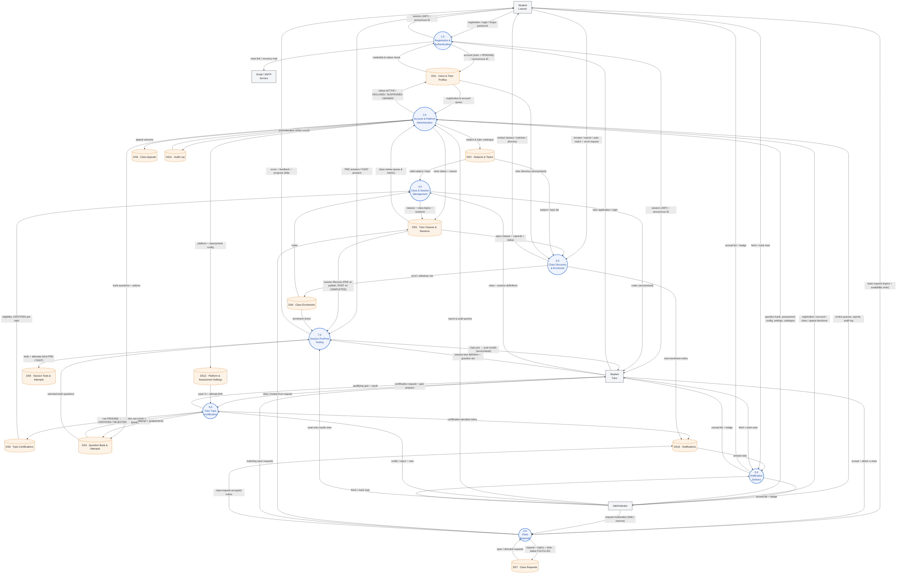
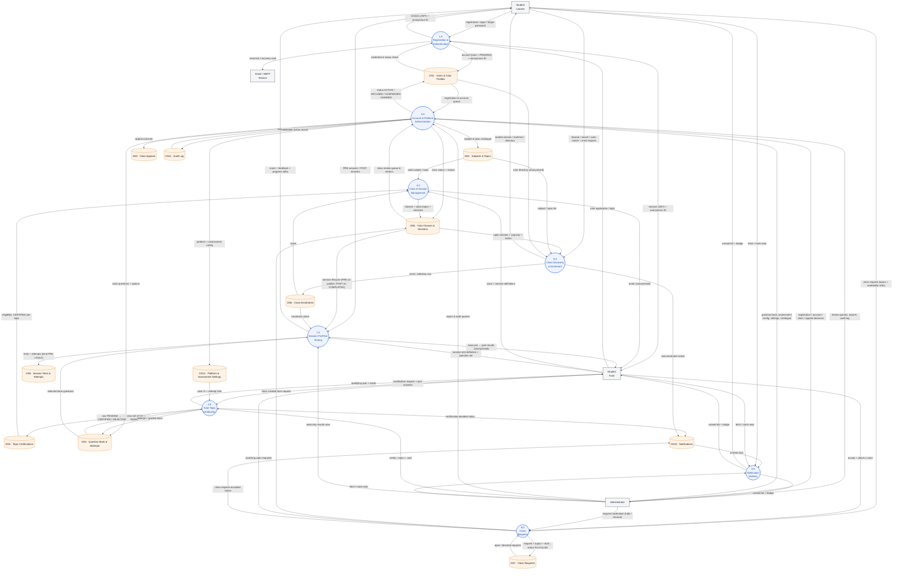

# Katuwang — Data Flow Diagrams (Level 0 & Level 1)

Prepared for the Capstone 2 panel presentation (IT 124, Module 01 — System
Design Refinement). The diagrams reflect the **system as actually built**:
every process maps to a real portal area + API route group, and every data
store maps to one or a tight cluster of Prisma models in
`prisma/schema.prisma` / `docs/erd.md`.

Rendered images live beside this file: `dfd-level0.png/.svg`,
`dfd-level1.png/.svg` (regenerate with `mmdc -i dfd-levelN.mmd -o dfd-levelN.png`).

**Notation** (Yourdon / DeMarco, drawn as a Mermaid flowchart):

| Symbol | Meaning |
|---|---|
| rectangle | External entity — a role or an outside service (the system boundary) |
| circle `(( ))` | Process — a transformation the system performs |
| open-ended box `[( )]` | Data store — persisted data |
| labelled arrow | Data flow (what moves, not control) |

Gated features: process **7.0** runs only when `sessionTestsEnabled`; the
chatbot assistant (a Level-2 detail of user support, not shown here) only when
`chatbotEnabled`. Both are `PlatformSetting`s, default on.

The double-blind anonymity mandate (RA 10173) lives on every learner⇄tutor
flow: they carry only the anonymous ID (`STU-####` / `TUT-####`), never a real
name, email, or contact detail.

---

## Level 0 — Context Diagram

The whole platform as a single process, showing only its boundary and the four
external entities it exchanges data with.

### External entities

| Entity | Role in the system |
|---|---|
| **Student Learner** (`STUDENT_LEARNER`) | Browses / enrols in classes, gets matched, posts class requests, takes session pre/post-tests. |
| **Student Tutor** (`STUDENT_TUTOR`) | Applies to tutor, earns per-topic certification, creates classes & sessions, builds session tests, fulfils class requests, appeals class moderation. |
| **Administrator** (`ADMIN`) | Reviews tutor registrations, moderates accounts / classes / requests, reviews certifications, maintains the question bank & assessment config, sets platform settings, reads analytics & audit log. |
| **Email / SMTP Service** | Outside service (`src/lib/mail.ts`) that delivers password-reset links and account-recovery mail. Delivery to the user's inbox is outside the system boundary. |

---

## Level 1 — Decomposition

Process 0 exploded into the eight processes the platform runs. Each is a
coherent module boundary; the numbering is reused in the presentation speaker
notes. All processes emit notification rows to **DS10** — three representative
flows are drawn, the rest omitted for clarity. Fine-grained admin actions and
the chatbot assistant decompose further at Level 2.

### Process catalogue

| # | Process | What it does | Portal / route group |
|---|---|---|---|
| 1.0 | Registration & Authentication | Learner self-registration; tutor application (lands `PENDING`); credential login (NextAuth JWT); forgot / reset password; atomic anonymous-ID issue via `generateAnonymousId()`. | `/register`, `/api/register`, `/api/auth/*` |
| 2.0 | Account & Platform Administration | Approve / decline tutor registrations; suspend / ban / reactivate accounts; edit subjects & topics; author bank questions & resolve question requests; set platform + assessment config; read reports & audit log. *(Level-2: registration review, account moderation, question bank, settings, analytics are separate subprocesses.)* | `/admin/users`, `/admin/registrations`, `/admin/subjects`, `/admin/assessment/*`, `/admin/settings`, `/admin/reports`, `/admin/audit-log` |
| 3.0 | Tutor Topic Certification | Tutor requests certification per (subject, topic); qualifying quiz drawn from the bank (`origin = BANK`); auto-grade against the snapshot pass %; admin certify / reject with note; "please add questions" requests. | `/tutor/assessments`, `/api/tutor/topic-certifications`, `/api/tutor/assessments/*`, `/admin/assessment/certifications` |
| 4.0 | Class & Session Management | Tutor creates a `TutorClass` (subject, topics, capacity, schedule) — **gated on a `CERTIFIED` row per topic** — then schedules / edits / cancels `ClassSession`s and views the anonymised roster. | `/tutor/classes`, `/tutor/classes/new`, `/api/tutor/classes/*` |
| 5.0 | Class Discovery & Enrolment | Learner browses / searches open classes; weighted matching (`src/lib/matching.ts`: subject, topic overlap, grade-level fit, schedule fit); enrol / unenrol within capacity; anonymised tutor directory. | `/learner/classes`, `/learner/match`, `/learner/tutors`, `/api/classes`, `/api/learner/match`, `/api/classes/[classId]/enroll` |
| 6.0 | Class Requests | Learner posts a `TopicRequest` (topics + availability slots + preferred setup) when no class fits; open / directed visibility rules; a tutor accepts and attaches a class; admin can moderate. | `/learner/requests`, `/tutor/requests`, `/api/tutor/topic-requests/[id]/accept`, `/admin/topic-requests` |
| 7.0 | Session Pre/Post Testing | Tutor builds one `SessionTest` per `ClassSession` (bank + self-authored questions); an enrolled learner takes the same set as a `PRE` then a `POST` attempt; per-question pre→post delta. `sessionTestsEnabled`-gated. | `/tutor/classes/[classId]/sessions/[sessionId]/test`, `/learner/.../test/[kind]`, `/admin/session-tests` |
| 8.0 | Notification Delivery | Serves each user their unread `Notification` rows + badge and marks them read. In-app only — no scheduler / push. | `/api/notifications`, `/api/notifications/read`, `/{role}/notifications` |

### Data-store → Prisma model map

| Store | Prisma model(s) |
|---|---|
| DS1 Users & Tutor Profiles | `User`, `TutorProfile`, `IdCounter`, `PasswordResetToken` |
| DS2 Subjects & Topics | `Subject`, `Topic` |
| DS3 Topic Certifications | `TopicCertification` |
| DS4 Question Bank & Attempts | `AssessmentQuestion`, `AssessmentOption`, `AssessmentAttempt`, `AssessmentAttemptItem`, `QuestionRequest` |
| DS5 Tutor Classes & Sessions | `TutorClass`, `ClassTopic`, `ClassSession` |
| DS6 Class Enrolments | `ClassEnrollment` |
| DS7 Class Requests | `TopicRequest`, `TopicRequestTopic`, `TopicRequestSlot` |
| DS8 Session Tests & Attempts | `SessionTest`, `SessionTestQuestion`, `SessionTestAttempt`, `SessionTestAttemptItem` |
| DS9 Class Appeals | `ClassAppeal` |
| DS10 Notifications | `Notification` (+ `ChatbotMiss` for the chatbot Level-2 detail) |
| DS11 Audit Log | `AuditLog` |
| DS12 Platform & Assessment Settings | `PlatformSetting` (+ assessment-config keys) |

### Traceability (Design Review Checklist)

- **Every data store maps to a real entity** — see the table above; each store
  is one or a tight cluster of Prisma models in `prisma/schema.prisma` /
  `docs/erd.md`.
- **Every process maps to an architecture component** — each row's route group
  is a slice of the modular-monolith app on the architecture slide (Route
  Handlers under `src/app/api/**` + the matching portal pages).
- **Every refinement traces to a panel recommendation** — panel rec R1 (model
  the tutor certification lifecycle) is process **3.0** plus the eligibility
  gate flow `DS3 → 4.0`. Before refinement this was a single boolean on `DS1`
  with no store of its own — no `DS3`, no gate.
